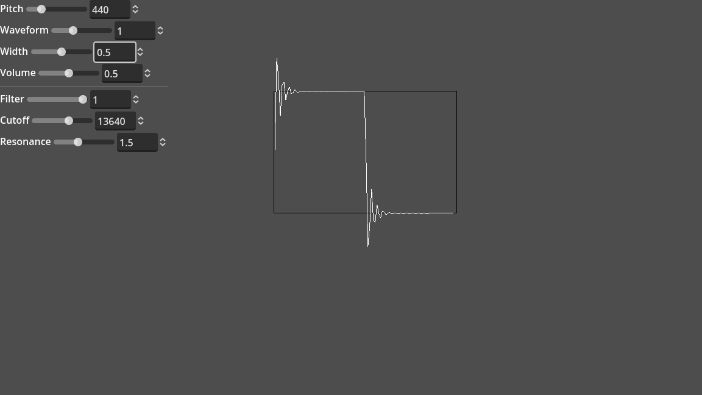

# Godot Synth

A simple synthesizer in Godot4.

It exists as a demonstration of how to generate sound in realtime in Godot.

Based on the
[Godot 3.5 Audio Generator Demo](https://github.com/godotengine/godot-demo-projects/tree/3.5-9e68af3/audio/generator).

## Usage

Add `synth.gd` to your scene. Call `start()` and tweak the synth parameters.

## Demo

Run the `demo/gui.tscn` scene.
